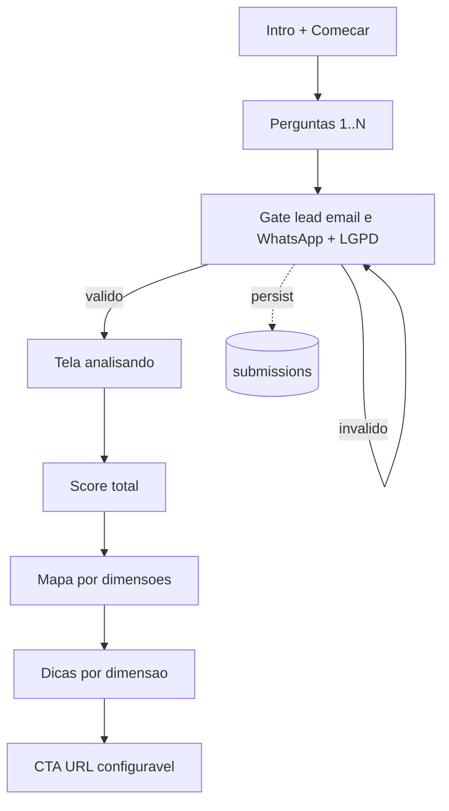

# Spec — Plugin VTIS Quiz (marketing / avaliação)

**Status:** Issue [#6](https://github.com/esvianna/saulocoelho.com/issues/6) **In Review** — MVP plugin v1.0.0  
**Data:** 2026-07-24  
**ADR:** ADR-008 em `DECISIONS.md`  
**Plugin/repo:** https://github.com/esvianna/vtis-quiz (`vtis-quiz`)  
**Modelo de referência:** [Bylevel Quiz Performance](https://bylevel.com.br/quiz-performance/)  
**Cliente inicial:** Saulo Coelho (`saulocoelho.com`)  
**Reuso previsto:** AmaMinerais e outros sites WordPress  

Issue GitHub: [#6](https://github.com/esvianna/saulocoelho.com/issues/6) · Rascunho histórico: [`vtis-quiz-issue-draft.md`](vtis-quiz-issue-draft.md).

---

## 1. Problema e objetivo

Oferecer quizzes de **avaliação / marketing** (wizard, pontuação, mapa por dimensões, CTA) reutilizáveis em vários clientes WP, com **captura de lead obrigatória antes do resultado**.

Não substitui:

| Produto existente | Onde | Diferença |
|-------------------|------|-----------|
| Questionário pós-inscrição | Tema Saulo (`sc_forms*`) | Pós-pedido, sem scoring/wizard |
| Quizzes LMS | AmaEducacional | Avaliação de aula / progresso |

---

## 2. Decisões de produto (fechadas)

| ID | Decisão |
|----|---------|
| D29 | Lead **antes** do resultado: e-mail + WhatsApp; sem lead válido → sem score/mapa |
| D30 | Prefixo / text domain / repo **`vtis-quiz`** (confirmado) |
| D31 | Separado de `sc_forms` e de quizzes LMS |
| D32 | MVP sem Woo/CRM acoplados |
| D33 | Skin no tema do host; CSS base neutro no plugin |

---

## 3. Fluxo UX (MVP)

Espelha o funil Bylevel, com gate de lead **entre** a última pergunta e o resultado.

### Telas

1. **Intro** — título, subtítulo, duração estimada, nº de perguntas, CTA “Começar”.
2. **Pergunta** — uma por ecrã; progresso “N de M”; escala (ex.: Nunca / Às vezes / Frequentemente); botão Voltar.
3. **Lead gate** — e-mail (obrigatório), WhatsApp (obrigatório no MVP Saulo), checkbox de consentimento LGPD, submit.
4. **Analisando** — estado de transição curto (pode ser animação CSS/JS).
5. **Score** — total vs máximo possível; CTA “Ver o que isso significa”.
6. **Mapa** — distribuição por dimensões (barras ou equivalente acessível).
7. **Dicas** — cards/acordeão por dimensão; “porquê” expansível.
8. **CTA + social proof opcional** — botão com URL; disclaimer legal no rodapé.
9. **Refazer** — limpa estado local e reinicia (nova submission se concluir de novo).

---

## 4. Arquitectura

| Escolha | Detalhe |
|---------|---------|
| Tipo | Plugin WP standalone (repo próprio `vtis-quiz`) |
| Host | Qualquer tema; Saulo = 1.ª instalação |
| Entrada front | Shortcode `[vtis_quiz slug="..."]` + rewrite opcional `/quiz/{slug}/` |
| Persistência | Tabelas `{prefix}vtis_quiz_*` |
| Admin | Menu próprio; capability `manage_options` (ou `vtis_quiz_manage` se criada) |
| Integrações MVP | Nenhuma; hook futuro `vtis_quiz_lead_captured` |

### Papel do tema Saulo (fase implementação)

- Página WP com shortcode ou URL rewrite.
- Skin: CSS no tema (`Playfair` / Inter / `#C5A059`) enfileirado quando o quiz estiver activo.
- Copy do 1.º quiz: fornecida pelo cliente (não inventar claims clínicos).

---

## 5. Modelo de dados (proposto)

Prefixo de tabela: `{wpdb->prefix}vtis_quiz_…`  
Versão de schema: constante `VTIS_QUIZ_DB_VERSION` no plugin (incrementar em migrações).

### `vtis_quizzes`

| Coluna | Tipo | Notas |
|--------|------|--------|
| id | bigint PK | |
| title | varchar | |
| slug | varchar unique | |
| status | varchar | draft / publish |
| intro_json | longtext | título, subtítulo, meta UI |
| settings_json | longtext | CTA, campos lead, disclaimer, max_score cache |
| version | int | incrementa ao alterar estrutura |
| created_at / updated_at | datetime | |

### `vtis_quiz_questions`

| Coluna | Tipo | Notas |
|--------|------|--------|
| id | bigint PK | |
| quiz_id | bigint FK | |
| sort_order | int | |
| prompt | text | |
| dimension_key | varchar | ex. `focus`, `energy` |
| options_json | longtext | `[{label, points}, …]` |

### `vtis_quiz_result_bands`

| Coluna | Tipo | Notas |
|--------|------|--------|
| id | bigint PK | |
| quiz_id | bigint FK | |
| min_score / max_score | int | faixa inclusiva |
| title / body | text | copy do resultado |

### `vtis_quiz_tips`

| Coluna | Tipo | Notas |
|--------|------|--------|
| id | bigint PK | |
| quiz_id | bigint FK | |
| dimension_key | varchar | |
| title / body / why | text | |

### `vtis_quiz_submissions`

| Coluna | Tipo | Notas |
|--------|------|--------|
| id | bigint PK | |
| quiz_id | bigint FK | |
| quiz_version | int | snapshot da versão |
| email | varchar | sanitizado |
| phone | varchar | WhatsApp normalizado |
| consent_at | datetime | |
| answers_json | longtext | question_id → option index/points |
| scores_json | longtext | total + por dimensão |
| ip_hash | varchar | opcional, one-way |
| user_agent | varchar | truncado |
| created_at | datetime | |

### Cálculo de score

- Pontos da resposta = `options[i].points`.
- Score por dimensão = soma das perguntas com aquele `dimension_key`.
- Score total = soma de todas as respostas.
- Máximo = soma dos maiores `points` por pergunta (ou valor em `settings_json`).

---

## 6. Contratos front (AJAX / REST)

MVP preferido: **admin-ajax** ou REST namespace `vtis-quiz/v1`, ambos com as mesmas regras de segurança.

| Acção | Método | Auth | Body / params | Resposta |
|-------|--------|------|---------------|----------|
| Obter quiz público | GET | público | `slug` | estrutura sem dados sensíveis de admin |
| Submeter | POST | nonce | `slug`, `answers`, `email`, `phone`, `consent` | `{ submission_id, total, max, dimensions, band, tips, cta }` |

Regras:

- Sem consentimento → `400`.
- E-mail/telefone inválidos → `400`.
- Respostas incompletas ou IDs inválidos → `400`.
- Rate limit por IP (ex.: N submissions / hora).
- Resultado **só** após persistência bem-sucedida do lead (D29).
- Não devolver PII de outros utilizadores.

Shortcode: `[vtis_quiz slug="desempenho-diario"]` — renderiza root HTML + enqueue JS/CSS do plugin.

---

## 7. Admin (MVP)

1. Listar / criar / editar / publicar quizzes.
2. CRUD de perguntas (ordem, dimensão, opções + pontos).
3. Faixas de resultado e dicas.
4. Settings: CTA label/URL, textos de intro, disclaimer, obrigatoriedade WhatsApp.
5. **Leads / submissions:** filtros por quiz e data; detalhe; **export CSV**.

---

## 8. Segurança e LGPD

Alinhado a `SECURITY.md` do tema Saulo e boas práticas WP:

- [ ] Sanitizar inputs (`sanitize_email`, `sanitize_text_field`, normalização de telefone).
- [ ] Escapar outputs (`esc_html`, `esc_attr`, `esc_url`).
- [ ] SQL só com `$wpdb->prepare()`.
- [ ] Nonce em mutações; capability no admin.
- [ ] Rate limiting no submit público.
- [ ] Não logar e-mail/telefone/respostas em `error_log`.
- [ ] Consentimento explícito no gate; texto de finalidade (avaliação + contacto comercial, conforme copy jurídico do cliente).
- [ ] Disclaimer: autopercepção; não substitui profissional de saúde (quando o copy for de performance/saúde).
- [ ] Export CSV só para quem tem capability adequada.
- [ ] Guard `ABSPATH` em todos os PHP do plugin.

---

## 9. Fases

| Fase | Conteúdo | Estado |
|------|----------|--------|
| Doc | ADR-008 + esta spec + issue #6 | **Feito** |
| MVP | Plugin + 1 quiz Saulo + lead gate + CSV + skin tema | **In Review** (v1.0.0) |
| 1.1 | Multi-quiz no mesmo site; duplicar quiz | Futuro |
| 2 | Hook `vtis_quiz_lead_captured` → webhook / CRM / Amafiliados | Futuro |
| 3 | Skin AmaMinerais; CTA produto Woo opcional | Futuro |

---

## 10. Riscos

- Claims de saúde/performance sem revisão jurídica.
- LGPD: base legal, retenção e pedidos de exclusão (processo operacional a definir com o cliente).
- ~~Repositório GitHub `vtis-quiz`~~ — criado.
- Conteúdo (perguntas/dimensões) definitivo depende do cliente.

---

## 11. Como testar (quando implementado)

Ver checklist no rascunho de issue [`vtis-quiz-issue-draft.md`](vtis-quiz-issue-draft.md). Em resumo: fluxo completo em staging (visitante), validação de lead, persistência, CSV, mobile, disclaimer, rate limit básico.
